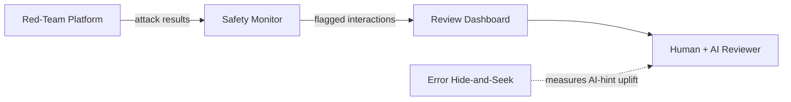

# Safeguards Engineering Portfolio

Three working systems that compose into a safety measurement and monitoring pipeline for large language models. Each project was built end-to-end and produced real data.

---

## The Three Projects

### llm-safety-monitor

A streaming Kafka (Confluent) pipeline that classifies every LLM interaction in real time using three independently fine-tuned transformer classifiers: response-level safety (pair), prompt intent (prompt), and harm taxonomy (taxonomy). An escalation router waits for all three classifier results, applies a configurable priority matrix, and routes flagged interactions to a downstream review queue. Classifiers were evaluated on held-out splits from HH-RLHF and WildGuard: prompt classifier F1 0.818 (n=2,512), taxonomy classifier F1 0.787 macro across 13 harm categories (n=4,337). 25/25 integration tests pass.

[Technical Deep-Dive](projects/llm-safety-monitor/README.md) · [Executive Summary](projects/llm-safety-monitor/SUMMARY.md)

---

### red-team-platform

A corpus-driven attack platform that runs jailbreak strategies against a language model, scores each result with a fine-tuned safety classifier, clusters successful attacks by mechanism, and publishes every result into the safety monitor's Kafka topic via an outbox publisher. A Phase 1 sweep of 1,797 attacks across 6 strategies against gemma2:9b (RTX 4090, $1.08 total) revealed a clean two-cluster result: output-format and persona attacks bypass at near-100% attack success rate (ASR), while suppression and combination attacks are blocked at 0% ASR with characteristically short refusal latency.

[Technical Deep-Dive](projects/red-team-platform/README.md) · [Executive Summary](projects/red-team-platform/SUMMARY.md)

---

### error-hide-seek (EHS)

A randomised controlled trial (RCT) measuring whether AI agent hints improve human detection of planted errors in academic text. Three conditions (unaided, agent-only, human+agent), 100 papers with one planted error each, 67 human review sessions, scored with true positive rate (TPR) and false positive rate (FPR) per error category across two experiments. The headline result is a null: overall uplift was −0.01 across both experiments. The finding is that detection performance is bounded by ground-truth access, not model capability or reviewer skill.

[Technical Deep-Dive](projects/error-hide-seek/README.md) · [Executive Summary](projects/error-hide-seek/SUMMARY.md)

---

## How They Compose

**Three-Project System Flow**



The three projects are architecturally connected. The safety monitor provides the real-time classification infrastructure. The red-team platform exposes that infrastructure to live attack traffic and injects results directly into the monitor's Kafka topic, so successful bypasses appear in the review queue as classified events. EHS operates at a different layer: rather than testing the monitor's classifiers, it measures what happens when a human reviewer and an AI agent jointly perform the kind of review task that safety teams do daily.

The full loop is: attacks are generated and classified by the red-team platform, published to Kafka, consumed by the monitor's classifiers, routed by the escalation engine, and surfaced in the review dashboard for a human reviewer. EHS provides empirical grounding for how much to trust that final human-AI review step.

---

## What This Demonstrates

Each project maps to a specific signal from the Anthropic Safeguards Infrastructure job description:

| Project | JD signal |
|---------|-----------|
| llm-safety-monitor | Data storage infrastructure, evaluation metrics, review tooling |
| red-team-platform | Detecting and measuring unwanted model behaviors |
| error-hide-seek | Metrics and measurement systems, human+AI review tooling |

Across all three projects: Python (FastAPI, SQLAlchemy, asyncio, uv), TypeScript (React, Vite, TanStack Query), Kafka (Confluent), PostgreSQL, fine-tuned transformer classifiers (DeBERTa-v3-base, RoBERTa-base), experimental design with real data.

---

## Repository Structure

```
muppet-labs/
├── PORTFOLIO.md                      ← this file
├── projects/
│   ├── llm-safety-monitor/           ← classifier pipeline, escalation router, React dashboard
│   │   ├── README.md                 ← technical deep-dive
│   │   └── SUMMARY.md                ← executive summary
│   ├── red-team-platform/            ← attack runner, outbox publisher, clustering
│   │   ├── README.md
│   │   └── SUMMARY.md
│   └── error-hide-seek/              ← RCT harness, review web UI, scoring engine
│       ├── README.md
│       └── SUMMARY.md
└── resources/
    ├── models/                       ← fine-tuned classifier checkpoints
    └── evals/                        ← held-out evaluation results (JSON)
```
