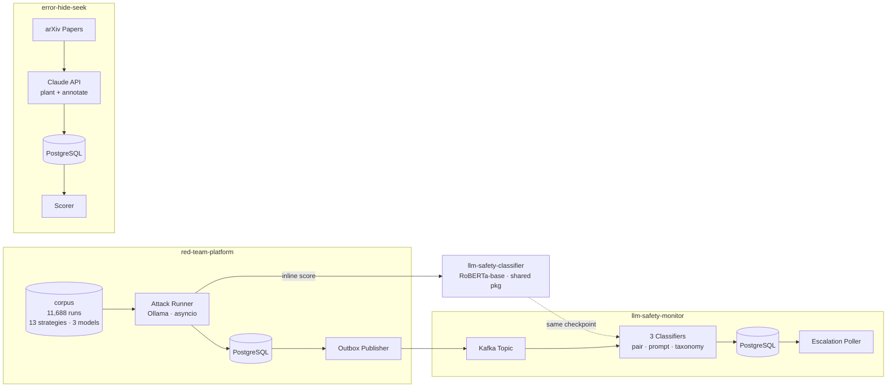
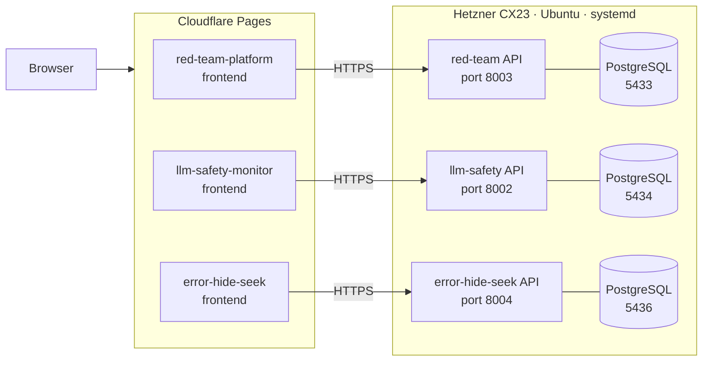

# AI Safety Engineering Portfolio

Three interconnected systems forming a complete safety measurement stack: a production safety monitor with fine-tuned classifiers, an automated red-team evaluation platform, and a randomised controlled trial measuring human uplift from AI-assisted error detection.

**Live demos:** [fotopnd.dev](https://www.fotopnd.dev)

---

## System architecture



### Production deployment (Hetzner CX23)



### How the three components connect

| Link | Description |
|---|---|
| Shared classifier | `llm-safety-classifier` package used by both monitor and red-team. Single `build_input_text(prompt, response)` → `f"{prompt} [SEP] {response}"` ensures both score the same input distribution. |
| Outbox → Kafka | After each attack sweep, `outbox-publisher` delivers run results to the monitor's Kafka topic with `source_dataset=red_team`. Monitor consumers process them identically to live traffic. |
| Measurement isolation | error-hide-seek is intentionally decoupled: it uses the Anthropic API for both planting and annotation, giving an independent measure of AI-assisted human uplift. |

---

## Components

| Component | Path | Port | Purpose |
|---|---|---|---|
| `llm-safety-classifier` | `packages/llm-safety-classifier/` | — | Shared inference package: `[SEP]` concatenation, model cache, version |
| `llm-safety-monitor` | `projects/llm-safety-monitor/` | Postgres: 5434 | Streaming classifier, metrics, disagreements, review queue |
| `red-team-platform` | `projects/red-team-platform/` | Postgres: 5433 | Jailbreak corpus, attack runner, ASR measurement, failure clusters |
| `error-hide-seek` | `projects/error-hide-seek/` | Postgres: 5436 | 3-condition RCT, error planting, blue-team annotation, TPR uplift |
| `llm-safety-monitor-training` | `projects/llm-safety-monitor-training/` | — | Training scripts for pair/prompt/taxonomy classifiers |
| Kafka | root `docker-compose.yml` | 9092 | Shared event bus (monitor consumers + red-team outbox publisher) |

---

## Quick start

```bash
# Install all packages (uv workspace — one lock file)
make setup

# Bring up full infrastructure (3 Postgres instances + Kafka)
make infra

# Apply migrations
make migrate

# Run all test suites
make test
```

See component READMEs below for project-specific setup and run instructions.

---

## Component READMEs

- [LLM Safety Monitor](projects/llm-safety-monitor/README.md) — streaming pipeline, calibration, disagreements, escalation router
- [Red-Team Platform](projects/red-team-platform/README.md) — corpus, attack runner, ASR methodology, [SEP] bug history
- [Error Hide and Seek](projects/error-hide-seek/README.md) — RCT design, error taxonomy, scoring logic, telemetry

---

## Port map (Hetzner)

| Service | Port |
|---|---|
| red-team-platform API | 8003 |
| red-team PostgreSQL | 5433 |
| llm-safety-monitor API | 8002 |
| llm-safety-monitor PostgreSQL | 5434 |
| error-hide-seek API | 8004 |
| error-hide-seek PostgreSQL | 5436 |
