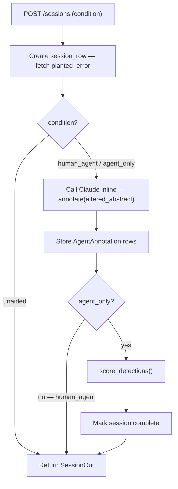

# Error Hide and Seek — Technical Deep-Dive

## Overview

Error Hide and Seek (EHS) is a randomised controlled trial (RCT) measuring the causal effect of AI agent hints on human error detection in text review tasks. Two experiments across 100 papers and 67 human sessions produced a signed uplift number: −0.01. The central finding is that detection performance is bounded by ground-truth access rather than model capability or reviewer skill. This document covers the experimental design, the auto-annotation pipeline, the scoring architecture, and the per-category breakdown that explains why the aggregate result is flat.

## Problem and Motivation

Measuring whether AI assistance improves human review is harder than it sounds. Observational approaches conflate reviewer skill, task difficulty, and hint quality. Without random assignment, any difference between "helped" and "not helped" reviewers may reflect pre-existing differences rather than the effect of assistance.

EHS addresses this with a three-condition RCT: unaided (human, no hints), agent_only (AI only, no human), and human_agent (human with AI hints). The uplift metric is human_agent TPR minus unaided TPR, which is the causal estimate of how much the hints moved detection rate. An additional agent_only condition provides the counterfactual: what would the AI do alone, at the same task difficulty?

The experiment required planted errors with known ground truth so that a scorer could evaluate detections without subjective judgment. Errors are planted into arXiv abstracts at session time using Claude as the planter, producing five categories of alteration with varying detectability properties.

## Design Decisions

**Three conditions rather than two.** A simple helped-vs-not-helped design would conflate two questions: does AI assistance help humans, and how well does AI perform independently? The agent_only condition answers the second question and provides a direct capability comparison at the same difficulty level. In experiment 2, human unaided TPR (0.30) and agent_only TPR (0.33) were nearly identical, meaning human pattern matching and LLM domain reasoning converge near the same ceiling when both lack ground-truth access.

**Auto-annotation on session creation, not as a deferred batch.** When `POST /sessions` receives a human_agent or agent_only request, the endpoint calls Claude inline (asyncio), parses the annotation result, and stores AgentAnnotation rows before returning the session to the caller. This design ensures the annotation is available when the reviewer sees the abstract. A deferred batch would require polling or push notification logic in the web client, and would introduce a race condition if the reviewer submitted before annotations arrived.

**Low-confidence annotation filtering for agent_only.** The blue-team prompt returns annotations with confidence labels (low, medium, high). For agent_only auto-scoring, annotations where `confidence == "low"` are excluded from the detection list before scoring. This reduces false positives in the automatically-scored condition without affecting the human_agent condition, where the human sees all annotations as hints and decides which to act on.

**is_true_positive checks both original and altered text.** The scorer's matching function checks whether the detection excerpt overlaps the planted original span or the planted altered span. This was a post-pilot fix: reviewers see the altered abstract, so they naturally flag altered text rather than the original. A scorer that only checked original_text was marking correct detections as false positives.

**Uplift as a scalar, not a distribution.** With n=33 sessions per condition in experiment 2, per-session variance is high. The aggregate uplift (human_agent TPR minus unaided TPR) is the primary metric. Category-level TPR provides the decomposition needed to understand the mechanism, though the uplift scalar is the result that answers the research question.

## Architecture

The system has three layers: a data pipeline, a review interface, and a scoring engine.

**Session Creation Pipeline**

The data pipeline is a FastAPI application (Python, asyncio, SQLAlchemy) backed by PostgreSQL. It manages experiments, papers, planted errors, review sessions, agent annotations, and human detections. Key endpoints:

- `POST /sessions` — creates a session, runs Claude inline if condition is human_agent or agent_only, returns the session with annotations attached
- `POST /reviews` — accepts human detections, scores each against the planted error, marks the session complete
- `GET /results/{experiment_id}` — computes TPR and FPR per condition and per category across all completed sessions

The review interface is a React/TypeScript SPA (Vite, TanStack Query) that presents the altered abstract and, for human_agent sessions, shows Claude's annotations as highlighted hints. The reviewer selects suspicious text, clicks to flag it, adds an optional note, and submits. Vite proxies all API requests through the dev server so the browser makes same-origin requests regardless of which port the API is running on, eliminating the CORS dependency on port assignment.

The scoring engine lives in `error_hide_seek/scoring/scorer.py` and is also called inline by the session endpoint for agent_only auto-scoring. It is a pure function of detection excerpts and planted spans, returning a `(planted_detected, false_positive_count)` tuple.

## Implementation Details

**The session creation endpoint is the architectural centrepiece.** For human_agent and agent_only sessions, `create_session` calls `annotate(llm, pe.altered_abstract)` and awaits it within the same request. If the Claude API call fails or the response does not parse, `session_row.agent_run_status` is set to `PARSE_FAILED` and the session is still created and the reviewer sees an empty annotation list rather than an error. Parse failure counts are stored per session for later analysis.

**Agent_only sessions are auto-scored immediately.** After Claude returns annotations, the agent_only path calls `score_detections` directly and writes the HumanDetection rows, setting `session_row.status = "completed"` and recording a `scored_result`. No human review step exists for this condition. This is the only path where detections are written and scored without human input.

**The web client computes navigation within a condition from a single prefetched sessions list.** `GET /experiments/{id}/sessions` returns all sessions ordered by condition and id. The React ReviewPage filters to the same condition as the current session, computes position and total, and passes the next session id to the submit mutation handler so navigation happens immediately on submit without a second API call.

## Results

**Experiment 1 (pilot-01, n=10, gemma2:9b):**

| Condition | TPR | FPR |
|-----------|-----|-----|
| Unaided | 0.67 | 0.00 |
| Agent-only | 0.33 | 0.83 |
| Human+Agent | 0.50 | 0.67 |
| Uplift | −0.17 | |

**Experiment 2 (exp-02-claude, n=100, claude-sonnet-4-6):**

| Condition | n | TPR | FPR |
|-----------|---|-----|-----|
| Unaided | 33 | 0.30 | 0.64 |
| Agent-only | 33 | 0.33 | 0.78 |
| Human+Agent | 34 | 0.29 | 0.72 |
| Uplift | | −0.01 | |

**Per-category TPR in experiment 2:**

| Category | Unaided | Agent-only | Human+Agent | Uplift |
|----------|---------|------------|-------------|--------|
| inverted_conclusion | 0.50 | 0.29 | 0.83 | +0.33 |
| false_citation | 0.25 | 0.17 | 0.29 | +0.04 |
| number_substitution | 0.29 | 0.00 | 0.14 | −0.14 |
| scope_extension | 0.33 | 0.57 | 0.14 | −0.19 |
| causal_inversion | 0.17 | 0.57 | 0.14 | −0.02 |

The category breakdown reveals the mechanism. Inverted conclusions are logical reversals detectable from the text alone: Claude correctly identified these as probable errors, and the hint confirmed the reviewer's intuition, producing +0.33 uplift. All other categories require either domain knowledge (plausibility of a specific numeric claim) or access to the original text (whether a citation exists, whether a causal direction was changed). For those categories, Claude's annotations either missed the error or flagged unrelated spans, and the reviewer followed false leads. FPR increased slightly in the human_agent condition (0.72 vs 0.64 unaided), consistent with noise injection from low-precision hints.

## Limitations and Future Work

**Non-expert reviewer confound.** The reviewer lacked specific domain expertise in the arXiv ML subfields used as the corpus (graph neural networks, continual learning, signal integrity). This confound affects all conditions equally, though it amplifies the difficulty of domain-dependent categories. A domain-expert reviewer condition would isolate the expertise effect and is the natural next experiment.

**Single error per paper.** Planting one error per paper limits the per-session signal. A multi-error design would allow measuring hint precision at the session level rather than treating each session as a single binary detection.

**No time-on-task measurement.** Session duration was not recorded. Uplift may manifest differently under time pressure or fatigue.

**Corpus scope.** Both experiments used arXiv AI abstracts. The detection ceiling result is specific to text-only review without original-document access. A different corpus (factual claims with verifiable sources, for example) would likely produce a different category breakdown.

## Conclusion

EHS demonstrates that measuring human-AI uplift requires a controlled experiment, not an observational study. The null result (uplift = −0.01) is more informative than a positive result would have been: it identifies the structural reason why AI hints do not help for most error types (no ground-truth access), and the one category where they consistently do (structural logical reversals). The auto-annotation pipeline, the three-condition design, and the per-category scorer together constitute a reusable measurement harness for future experiments of this kind.
