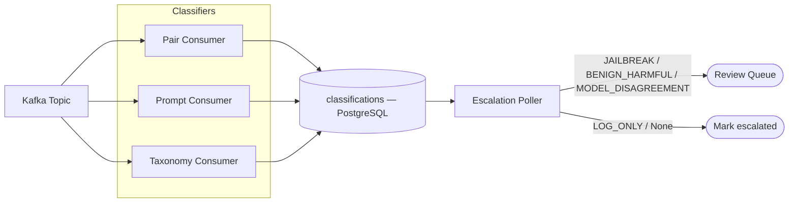

# LLM Safety Monitor — Technical Deep-Dive

## Overview

The LLM Safety Monitor is a streaming Kafka pipeline that classifies every LLM interaction using three independently fine-tuned transformer classifiers, then routes flagged interactions to a review queue based on inter-classifier agreement patterns. The architecture's central assumption is that any single classifier will be wrong on some inputs, and that disagreement between classifiers is a more reliable safety signal than any one classifier's confidence score. This document covers the classifier design, the escalation logic, the threading model, and the evaluation results that ground each architectural claim.

## Problem and Motivation

A safety monitoring system built around a single classifier has a structural problem: its errors are invisible. When the classifier is confident and wrong, no signal distinguishes that case from a correct high-confidence prediction. The only way to catch systematic errors is to add independent signal sources that can disagree.

Three classifiers looking at an interaction from different angles produce four qualitatively different outcomes that map to distinct escalation responses: both the response-level and prompt-level classifiers flag the interaction (probable jailbreak), only the response-level classifier flags it (benign prompt with harmful output), only the prompt-level classifier flags it (suspicious prompt that did not produce a harmful response), or neither flags it while the taxonomy classifier identifies a specific harm category (model disagreement, lower confidence). The escalation router translates this 2x2 matrix into four escalation reasons with configurable severity levels.

## Design Decisions

**Three independent classifiers rather than one multi-head model.** A single model with three output heads would share weights and representations across all three tasks, reducing the independence of the three signals. Three separately fine-tuned models (pair safety, prompt intent, harm taxonomy) allow disagreement at the representation level, not just at the output layer. The pair and prompt classifiers both use DeBERTa-v3-base, fine-tuned separately on HH-RLHF and WildGuard splits.

**Escalation logic as a pure function.** `compute_escalation_reason` in `escalation/router.py` takes six scalar inputs (pair label and confidence, prompt label and confidence, taxonomy labels, and whether a response is present) and returns an `EscalationReason` enum value or None. It has no database calls, no side effects, and no I/O dependencies. This makes it straightforward to unit-test exhaustively — the full logic is expressed as conditional branches over six inputs, and every branch is covered by the test suite.

**Four daemon threads in parallel rather than a processing chain.** The pair consumer, prompt consumer, taxonomy consumer, and escalation poller run as independent daemon threads (via `threading.Thread`). Each classifier consumer reads from the same Kafka topic, classifies events, and writes classification rows to PostgreSQL. The poller queries for events where all three classifications exist, then applies the escalation logic. This design means classifier consumers never block each other, and a slowdown in one classifier (for example, a large batch arriving for the taxonomy classifier) does not back-pressure the others.

**Poller waits for all three classifiers before escalating.** The poller's `_check_ready` query selects only interactions that have all three classification rows present. A 10-second timeout (`_check_timed_out`) catches events where one classifier failed or timed out, marks them `escalated=TRUE` with a warning log, and moves on. This prevents a stuck classifier from causing event backlog while preserving the invariant that the escalation router always sees all three signals when it fires.

**Pair classifier tuned for recall rather than F1.** The pair classifier's evaluation results show F1 0.549, precision 0.393, and recall 0.910 (n=6,337). This is intentional: the escalation router treats pair=1 as one input among three, not as a final verdict. A safety-conservative design should flag more than it misses at the classifier level and rely on the escalation logic to reduce false positives through inter-classifier filtering. A pair classifier tuned for F1 would produce a lower recall, meaning some harmful interactions would produce pair=0 and reach the escalation router with a weaker signal.

**BENIGN_HARMFUL takes precedence over MODEL_DISAGREEMENT.** The escalation priority order is: JAILBREAK (pair=1 and prompt=1) > BENIGN_HARMFUL (pair=1 and prompt=0) > LOG_ONLY (pair=0 and prompt=1) > MODEL_DISAGREEMENT (both 0, taxonomy labels present). A comment in the router documents this explicitly: the BENIGN_HARMFUL case (a benign-seeming prompt that produced a harmful response) is the harder safety problem and gets higher priority than a taxonomy-only flag.

## Architecture

**Classification and Escalation Pipeline**

Events enter through a Kafka topic. Each event is an `LLMInteractionEvent` JSON payload containing a prompt text, an optional response text, and metadata (event id, source dataset, ground truth labels if known). Three consumer threads each subscribe to the topic, classify the event using their respective DeBERTa-v3-base model, and write a `classifications` row to PostgreSQL with the predicted label, confidence score, and classifier version.

The escalation poller runs on a 2-second polling loop. When it finds an interaction with all three classifications, it loads the classification results, calls `compute_escalation_reason`, and either posts to the case-queue API (for JAILBREAK, BENIGN_HARMFUL, and MODEL_DISAGREEMENT) or skips (for LOG_ONLY and None). It then marks the interaction as escalated regardless of whether a case was created, ensuring the interaction is not reprocessed.

The FastAPI application exposes endpoints for streaming events into the monitor (`POST /stream`), querying stored interactions and classifications, reviewing flagged cases, and retrieving per-classifier metrics. The React dashboard (TypeScript, Vite, TanStack Query) renders live event throughput, classifier score distributions, escalation reason breakdowns, and a review queue for flagged interactions.

The red-team platform publishes attack results into the same Kafka topic via the outbox publisher, setting `source_dataset: "red_team"`. The monitor's consumers process these events identically to live traffic, so red-team bypass events appear in the review queue alongside organic interactions.

## Implementation Details

**Classifier consumers use a shared base class.** `consumers/base.py` defines the Kafka consumer setup, the main poll loop, the database session lifecycle, and the stop signal. Each of the three concrete consumers inherits from this base and implements a single `classify(event) -> ClassificationResult` method. This reduces the per-classifier implementation to the model loading and inference logic.

**Pair classifier calibration is bimodal.** The pair classifier's calibration bins show two populated regions: 0.0–0.1 (3,059 samples, 4.2% positive rate) and 0.5–0.6 (3,278 samples, 39.3% positive rate). The model outputs scores near 0 or near 0.5 rather than spanning the full probability range. This is a known property of binary DeBERTa fine-tuning on tasks with inherent ambiguity at the decision boundary: the model is confident about clear negatives and uncertain about borderline cases. The escalation router uses label (0 or 1) rather than raw confidence for the primary logic, so the bimodal distribution does not break the escalation matrix. For the prompt classifier, calibration is well-distributed across all bins with monotonically increasing positive rates.

**The taxonomy classifier returns a list of harm category labels rather than a single label.** An interaction can be assigned to multiple harm categories. `taxonomy_labels` is stored as a JSONB array in the `classifications` table. The escalation router checks `if taxonomy_labels` (non-empty list) as the MODEL_DISAGREEMENT condition. Per-category F1 scores range from 0.584 (causing material harm by disseminating misinformation) to 0.945 (copyright violations), with all 13 categories above 0.58.

**Classifier version is stored with each classification row.** The `alembic/versions/004_add_classifier_version.py` migration added the `classifier_version` column to the `classifications` table. This allows historical runs to be associated with the checkpoint that produced them, supporting before/after comparison when classifiers are retrained.

## Results and Validation

**Classifier evaluation (held-out splits, 2026-06-07):**

| Classifier | F1 | Precision | Recall | Eval samples |
|------------|-----|-----------|--------|------|
| pair | 0.549 | 0.393 | 0.910 | 6,337 |
| prompt | 0.818 | 0.752 | 0.897 | 2,512 |
| taxonomy | 0.787 macro | — | — | 4,337 |

Taxonomy per-category F1: 0.584 (misinformation/material harm) to 0.945 (copyright violations). All 13 categories above 0.58.

**Integration tests:** 25/25 pass, covering API endpoints, escalation logic (all branches of `compute_escalation_reason`), and the full classification-to-escalation pipeline.

**Red-team integration:** 1,797 attack events published from the red-team platform were consumed by all three classifiers and processed through the full escalation pipeline, confirming end-to-end connectivity between the two systems.

## Limitations and Future Work

**Single-turn classification only.** Each interaction is classified independently. The classifiers have no access to conversation history, so multi-turn jailbreak strategies that build context across turns are not detected as part of a pattern. Conversation-level classification would require grouping events by session id before inference.

**Pair classifier precision.** Precision of 0.393 means the pair classifier flags many benign interactions. The escalation router reduces the effective false positive rate by requiring inter-classifier agreement for high-severity escalation, though MODEL_DISAGREEMENT escalations (taxonomy-only flags) can still surface from false pair=0 events where the taxonomy classifier fires.

**Classifier independence assumption.** The three classifiers are trained on overlapping data (HH-RLHF appears in the training sets for pair and taxonomy). Complete statistical independence between classifiers would require training on non-overlapping splits, which was not done for this implementation.

**No streaming dashboard updates.** The React dashboard polls the API on a fixed interval rather than using WebSockets or server-sent events. This is adequate for monitoring cadences of seconds to minutes, though it introduces latency for real-time incident response.

## Conclusion

The monitor's core contribution is treating inter-classifier disagreement as a first-class signal rather than treating the escalation router as a post-processing step. The pair classifier is intentionally recall-heavy. The taxonomy classifier provides harm-category specificity. The prompt classifier provides intent context. The escalation priority matrix maps the four possible classifier agreement states to actionable review outcomes. Three independent classifiers with mediocre individual F1 scores, combined through a well-reasoned agreement logic, produce a monitoring system that is harder to fool than any single high-F1 classifier.
