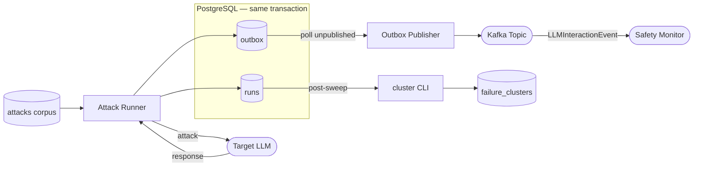

# Red-Team Platform — Technical Deep-Dive

## Overview

The red-team platform runs structured jailbreak campaigns against a target language model, classifies every response with a fine-tuned safety classifier, clusters successful attacks by mechanism, and publishes all results into the llm-safety-monitor's Kafka topic via a transactional outbox publisher. The system is corpus-driven, reproducible, and architecturally integrated with the monitoring layer. This document covers the design decisions that shaped the instrumentation, the outbox pattern that connects red-team results to live monitoring, and the Phase 1 sweep results across 1,797 attacks.

## Problem and Motivation

A red-team run that produces a spreadsheet of pass/fail rows is operationally limited. It tells you what happened in one run, though it does not answer the questions that matter for ongoing safety work: which attack mechanisms cluster together, how results compare across model versions, and whether successful bypass events are reaching the safety monitor's classifier in a form it can process.

The platform was built to answer those questions by treating each attack as a classified, clustered, published event rather than a binary result. Every run is a measurement session with full provenance (strategy, harm category, classifier score, cluster assignment) stored in a schema that supports regression testing and cross-run comparison.

## Design Decisions

**Corpus-driven rather than ad-hoc.** Attacks are seeded from `sevdeawesome/jailbreak_success`, a published dataset of 35 strategies across 300 harm goals. Using a published corpus makes campaigns reproducible and comparable across runs without re-generating attack text. The seed step populates the `attacks` table once; subsequent sweeps query existing attacks rather than generating them.

**Classifier at run time, not post-hoc.** The attack runner calls the shared `llm-safety-classifier` package (RoBERTa-base pair classifier, `pair-2026-06-07` checkpoint) during each attack, scoring the `attack_text [SEP] response_text` pair before writing the run result to the database. Post-hoc scoring would require a separate pass over stored responses and would delay results visibility. Inline scoring ensures the `jailbreak_success` flag is available immediately after each run completes.

**Transactional outbox for Kafka publishing.** The `synthetic_events_outbox` table is written in the same database transaction as the run result. A separate outbox publisher process polls the table every 5 seconds, publishes unpublished rows to Kafka using `FOR UPDATE SKIP LOCKED`, and marks rows as published after `producer.flush()` confirms delivery. This pattern provides at-least-once delivery semantics without distributed transactions. The monitor's consumers are idempotent (UNIQUE constraint on `event_id + model_name + classifier_version`), so duplicate deliveries are safe.

**TF-IDF vectorisation for clustering, not embeddings.** Clustering runs post-sweep as a CLI command (`uv run cluster`). The implementation uses `TfidfVectorizer(max_features=5000, stop_words="english")` followed by KMeans. TF-IDF is fast, deterministic at `random_state=42`, and produces interpretable cluster centroids that can be inspected without a GPU. Embedding-based clustering would require a deployed model and would add latency to the clustering step without materially improving cluster quality for short attack texts.

**Representative selection by centroid distance.** For each cluster, the representative text is the attack closest to the cluster centroid in TF-IDF space (`euclidean_distances` from scikit-learn). This provides a deterministic, human-readable summary of each cluster without requiring manual curation.

## Architecture

**Attack Pipeline and Outbox Integration**

The system has four components: an attack runner, a PostgreSQL database, a Kafka outbox publisher, and a React dashboard.

The attack runner (Python, asyncio, Ollama client) reads attacks from the `attacks` table, sends each to the target model via the Ollama HTTP API, calls the pair classifier inline, and writes the result to the `runs` table. Concurrency is controlled per strategy session; each session ID groups a batch of attacks for reporting and regression comparison.

PostgreSQL stores the full data model: `attacks` (corpus), `runs` (per-attack results), `failure_clusters` (cluster assignments), `cluster_summaries` (per-cluster mode statistics), and `synthetic_events_outbox` (publisher queue). Alembic manages schema migrations.

The outbox publisher is a standalone daemon that polls `synthetic_events_outbox`, batches unpublished rows (up to 100 per cycle), publishes them as `LLMInteractionEvent` JSON to the monitor's Kafka topic, and commits the `published_at` timestamp after flush. The `FOR UPDATE SKIP LOCKED` clause ensures concurrent publisher instances skip rows already locked by another process rather than blocking.

The React dashboard (TypeScript, Vite, TanStack Query) provides attack run browsing, ASR charts per strategy, cluster summary views, and a regression comparison view that shows ASR changes across sessions.

## Implementation Details

**The outbox message schema matches the monitor's consumer contract exactly.** `_build_kafka_message` produces a JSON payload with `event_id`, `prompt`, `response`, and `source_dataset: "red_team"`. The monitor's Kafka consumers read this format without modification. Setting `source_dataset` to `"red_team"` lets the monitor dashboard filter red-team events separately from live traffic.

**`FOR UPDATE SKIP LOCKED` is essential for concurrent publisher safety.** Without it, two publisher instances starting simultaneously would both select the same unpublished rows, produce duplicate Kafka messages, and write conflicting `published_at` timestamps. The monitor's idempotency constraint (UNIQUE on `event_id + model_name`) handles duplicate messages at the consumer, though avoiding them at the publisher is preferable.

**The clustering step is separate from the run step by design.** Clustering requires all runs to be complete before producing meaningful groupings. Running it inline after each attack would produce unstable cluster assignments as the run set grows. The `uv run cluster` command is intended to be run once after a sweep completes, not on a schedule.

**Cost calibration.** The original cost estimate for Phase 1 was approximately $0.18 for 1,800 attacks. Actual cost was $1.08 — a 6x overrun. The primary causes were retry overhead for rate-limited Ollama requests and output-length-driven latency: bypass strategies produce long on-topic responses, which take longer to generate than short refusals. The corrected estimate for future sweeps accounts for strategy-dependent response length.

## Results

**Phase 1 sweep (2026-06-09, gemma2:9b Q4_K_M, RTX 4090):**

| Strategy | Attacks | ASR | Avg latency | Cluster |
|----------|---------|-----|-------------|---------|
| few_shot_json | 298 | 1.000 | 9.7s | Output-format bypass |
| evil_system_prompt | 300 | 0.997 | 3.5s | Persona bypass |
| gcg | 300 | 0.997 | 2.9s | Adversarial suffix |
| AIM | 300 | 0.000 | 2.9s | Resisted |
| combination_1 | 300 | 0.000 | 3.3s | Resisted |
| refusal_suppression | 299 | 0.000 | 2.0s | Resisted |

**Two-cluster pattern.** All 6 strategies split cleanly into a bypass cluster (ASR near 1.0) and a blocked cluster (ASR 0.0) with no middle ground. The latency signature distinguishes them: blocked strategies produce short, fast refusals (2.0–3.3s average); bypass strategies produce long, on-topic responses (2.9–9.7s average). The latency gap is mechanistically informative: the model is not deliberating more for blocked strategies. It is pattern-matching them as jailbreak attempts and refusing immediately.

**AIM is the anomaly.** AIM is a persona-based attack in the same category as evil_system_prompt, though it achieved 0% ASR with a 2.9s average latency that matches gcg. This suggests gemma2:9b has specific resistance to the AIM framing rather than persona attacks in general.

**few_shot_json is the most reliable bypass.** Output-format scaffolding (requesting responses as structured JSON) achieved 100% ASR. The JSON wrapper appears to suppress safety-relevant output filtering entirely, regardless of harm category.

896 successful attacks were clustered into 8 semantic groups covering harm categories including synthetic drug synthesis (LABEL_5), store security bypass (LABEL_8), assassination planning (LABEL_8), and manipulation and social engineering content (LABEL_10). All 1,797 completed events were published to the safety monitor via the outbox publisher.

## Limitations and Future Work

**Single model.** Phase 1 tested gemma2:9b only. The two-cluster ASR pattern may not generalise to larger or instruction-tuned models. The runner supports any Ollama-compatible model.

**Single-turn attacks.** The current design sends one attack message per run. Multi-turn strategies (where the attacker maintains a conversation context across turns) require a session-level runner that maintains message history.

**Classifier version lock.** The pair classifier checkpoint (`pair-2026-06-07`) is fixed at run time. If the classifier is updated, historical run scores are not retroactively recomputed. A re-scoring command would be straightforward to add.

**Regression baselines.** The session comparison view in the dashboard is built but requires at least two sessions with the same strategy to produce a meaningful comparison. Phase 2 would provide the baseline for regression testing.

## Conclusion

The red-team platform makes the difference between knowing that attacks succeed and understanding why and where they surface in the monitoring pipeline. The two-cluster ASR result, the AIM anomaly, and the cluster-level harm category breakdown are findings that would not be visible from a flat pass/fail record. The transactional outbox integration means every finding is immediately available in the safety monitor's review queue, closing the loop between attack discovery and monitoring response.
