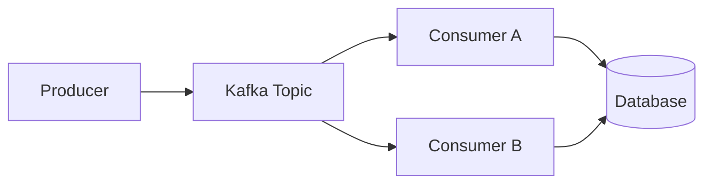
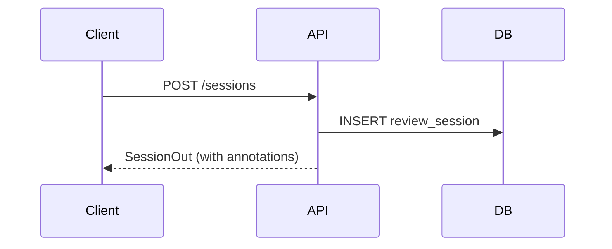
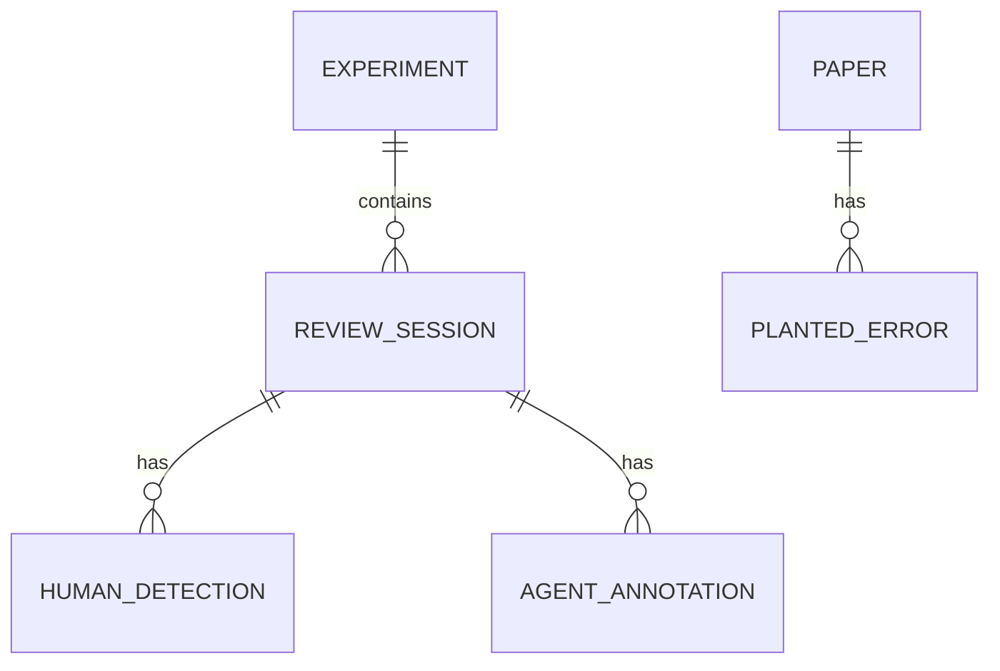
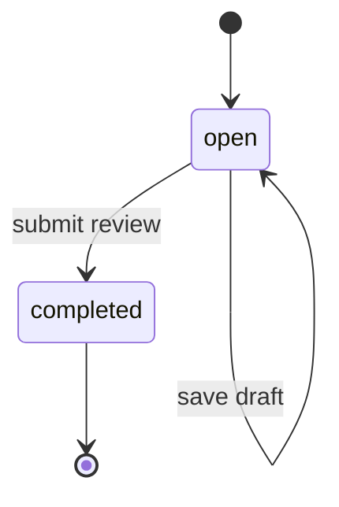

# diagram-types.md — Diagram Type Catalog

> Loaded by: `diagram-brief` (type selection), `diagram-author` (syntax reference).
> Lists available diagram types, Mermaid syntax, and when to choose each.

---

## How to Select a Diagram Type

Ask two questions:

1. **What does the content describe?** Relationships between components, a time-ordered sequence, a data model, or an entity lifecycle?
2. **What does the reader need to do after seeing it?** Understand structure, follow a flow, trace a sequence, or navigate a schema?

Then find the type below that matches both. If two types fit, prefer the one with lower visual complexity for the target audience tier.

---

## Diagram Types

### Flowchart / Directed Graph

| Field | Value |
|-------|-------|
| **Mermaid keyword** | `flowchart LR` (left-right) or `flowchart TD` (top-down) |
| **Best for** | Component relationships, data flow between systems, pipeline stages, decision paths |
| **Not for** | Time-ordered interactions (use Sequence); database schemas (use ER) |
| **Typical complexity** | Low to medium — soft limit 10 nodes; see Complexity Thresholds section |

**Minimal example:**

**Notes:** Use `subgraph` to group related nodes. Left-right (`LR`) works better for pipeline flows; top-down (`TD`) works better for hierarchical structures. Node labels should be under ~30 characters. Use `[Label]` for processes, `[(Label)]` for databases, `([Label])` for external systems.

---

### Sequence Diagram

| Field | Value |
|-------|-------|
| **Mermaid keyword** | `sequenceDiagram` |
| **Best for** | Time-ordered interactions between two or more actors or systems; request-response flows; async handoffs |
| **Not for** | Static component relationships (use Flowchart); schemas (use ER) |
| **Typical complexity** | Medium — up to ~6 participants and ~10 messages before the diagram becomes hard to follow |

**Minimal example:**

**Notes:** Use `-->>` for asynchronous or response messages; `->>`  for synchronous calls. Use `Note over A,B: text` to annotate a step. Participants appear in left-to-right order of first mention.

---

### Entity-Relationship Diagram

| Field | Value |
|-------|-------|
| **Mermaid keyword** | `erDiagram` |
| **Best for** | Database schemas, data model relationships, foreign key structures |
| **Not for** | System architecture (use Flowchart); runtime interactions (use Sequence) |
| **Typical complexity** | Medium — up to ~8 entities before layout becomes crowded |

**Minimal example:**

**Notes:** Relationship labels (`contains`, `has`) should be verb phrases. Cardinality markers: `||` (exactly one), `|o` (zero or one), `o{` (zero or many), `|{` (one or many).

---

### State Diagram

| Field | Value |
|-------|-------|
| **Mermaid keyword** | `stateDiagram-v2` |
| **Best for** | Entity lifecycle — how a record, session, or job moves through states; valid transitions |
| **Not for** | Multi-entity flows (use Flowchart or Sequence); schemas (use ER) |
| **Typical complexity** | Low to medium — up to ~8 states |

**Minimal example:**

**Notes:** Use `[*]` for entry and exit points. Label transitions with the event or condition that triggers them. Use `state "Long Name" as alias` if state names are long.

---

## Quick Selection Guide

| If the content describes... | Use |
|----------------------------|-----|
| How components connect and data flows between them | Flowchart |
| A sequence of messages or calls over time | Sequence Diagram |
| A database schema or data model | Entity-Relationship Diagram |
| How an entity moves through states | State Diagram |

---

## Complexity Thresholds

If a diagram exceeds these rough limits, consider splitting it into two focused diagrams rather than cramming more onto one canvas:

| Type | Soft limit | Hard limit |
|------|-----------|------------|
| Flowchart | 10 nodes | 15 nodes |
| Sequence | 5 participants, 8 messages | 7 participants, 12 messages |
| ER | 6 entities | 10 entities |
| State | 6 states | 10 states |

When a diagram would exceed the hard limit, note the split in the diagram-brief's Handoff section so the author can produce two focused diagrams instead of one crowded one.
